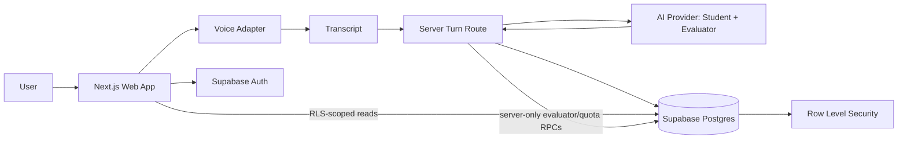

# Feynman-in-a-Loop — Architecture

Status: **Working architecture**  
Last updated: **7 October 2026**

## Goal

Keep the architecture small enough for a hackathon while preserving clean boundaries between:

- browser UI and voice capture;
- authenticated application state;
- AI provider calls;
- structured evaluation;
- persistent learning history.

Provider-specific choices should remain replaceable until a zero-cost AI/voice stack is intentionally selected.

## High-level architecture



## Main components

### Browser / Next.js client
Responsibilities:
- navigation;
- sidebar;
- teaching-room UI;
- Student Orb;
- microphone controls;
- visualizer;
- transcript rendering;
- user-visible state;
- Supabase browser client for allowed user-scoped operations.

Must not contain:
- service-role keys;
- private AI provider keys;
- evaluator system instructions that must remain server-side;
- privileged database logic.

### Next.js server boundary
Use route handlers/server actions where appropriate for:
- private AI calls;
- structured evaluator validation;
- rate limits;
- server-side authorization checks where needed;
- provider abstraction;
- sensitive configuration.

### Supabase Auth
Responsibilities:
- sign up;
- sign in;
- sign out;
- authenticated user identity;
- session/JWT handling.

### Supabase Postgres
Responsibilities:
- session metadata;
- interaction turns/transcripts;
- mastery/evaluation state;
- quota/claim lifecycle.

There is no custom profile table in the PoC. Browser reads are RLS-scoped. Direct table writes are revoked from authenticated clients; mutations go through narrow RPCs, with evaluator/quota RPCs restricted to the trusted server.

### Voice adapter
Exact implementation is open.

The UI should call an internal abstraction rather than directly depending on one provider:

```ts
interface SpeechInputAdapter {
  start(): Promise<void>
  stop(): Promise<void>
  onPartialTranscript(cb: (text: string) => void): void
  onFinalTranscript(cb: (text: string) => void): void
}
```

Possible backends:
- browser SpeechRecognition;
- free hosted STT;
- realtime multimodal API;
- local/browser inference.

### AI provider adapter
Do not let product logic depend on one vendor API shape.

Conceptual interface:

```ts
interface AIProvider {
  completeTurn(input: TurnInput): Promise<TurnOutput>
}
```

One model call returns two schema-separated regions: private evaluator state and the public student response. The server validates both and exposes only the public projection.

## Data flow — teaching turn

1. User starts voice input.
2. Speech adapter emits transcript.
3. Completed learner turn is persisted before any model call.
4. Server verifies the user, atomically claims model quota, and builds bounded evidence-aware context.
5. One model request returns private evaluator state plus a short public student response.
6. Server validates schema, evidence grounding, state transition legality, and the public/private boundary.
7. Valid evaluator state + linked student response are applied atomically through a server-only database RPC.
8. UI receives only the sanitized student response and public stage.

## Data flow — completion

1. Evaluator sees enough evidence.
2. Transfer challenge has been answered.
3. Evaluator returns final structured result.
4. Server validates output.
5. Session becomes `completed`.
6. Final result is persisted.
7. Sidebar/history updates.

## Data model

### learning_sessions
- one row per attempt;
- user-owned topic/status/stage;
- `model_calls_used` authoritative quota counter;
- `mastery`, `evidence_ledger`, `mastery_result` JSONB;
- mutable while `in_progress`, frozen after completion.

### session_turns
- learner turns use `client_turn_id` for idempotency;
- student turns use `responds_to_turn_id` to link to the learner turn they answer;
- `evaluation_state`: `pending | claimed | applied`;
- `evaluation_claimed_at` supports stale-claim recovery;
- partial unique indexes enforce one response per learner turn and one live evaluation per session.

No evaluator/system transcript rows are stored.

## Authorization / RLS model

- `authenticated` receives SELECT-only table privileges.
- RLS SELECT policies expose only rows where `user_id = auth.uid()`.
- Direct INSERT/UPDATE/DELETE is revoked from authenticated clients.
- Browser-safe create/append RPCs are narrow `SECURITY DEFINER` functions that derive identity from `auth.uid()`.
- Evaluator/quota RPCs are `SECURITY INVOKER`, executable only by `service_role`, and are invoked by the Next.js server after JWT verification.
- The server-only Supabase secret key is never included in browser code.
- Sensitive RPCs still compare the server-supplied verified user id with row ownership before mutation.

## Context strategy

Do not send unlimited transcripts to the model.

For each turn, construct bounded context:
- topic;
- current mastery state;
- recent relevant turns;
- unresolved misconception;
- current stage.

Persist the full transcript for the user, but keep model context intentional.

## Server-side validation

Evaluator output must be parsed against a schema before persistence.

Example high-level shape:

```json
{
  "stage": "repair",
  "studentState": "confused",
  "dimensions": {
    "coreIdea": "mastered",
    "mechanism": "partial",
    "misconceptionRepair": "untested",
    "transfer": "untested"
  },
  "nextAction": "challenge",
  "targetGap": "sorted invariant"
}
```

If output is invalid:
- retry once with a repair prompt if appropriate;
- otherwise show a recoverable AI error;
- never invent a valid result client-side.

## Deployment

### Vercel
- Next.js application
- server routes
- server-only environment variables

### Supabase
- Auth
- Postgres
- RLS

### AI / voice
Zero-cost provider or local/browser approach selected after testing.

## Architecture principles

1. Keep provider code behind adapters.
2. Keep privileged credentials server-side.
3. Keep learning state structured.
4. Treat model output as untrusted input.
5. Persist only validated state.
6. Avoid unnecessary agents, queues, vector stores, or microservices.
7. Optimize for a reliable 1–3 minute judge demo.

## Remaining architecture decisions

- Groq model choice: GPT-OSS 20B vs 120B, decided by Slice 3 benchmark.
- Whether student output gains TTS later (not required for PoC).
- Whether browser recognition needs any demo-specific caveats beyond the typed fallback.
- Best-effort per-user/IP abuse limiting beyond the authoritative per-attempt database cap.
