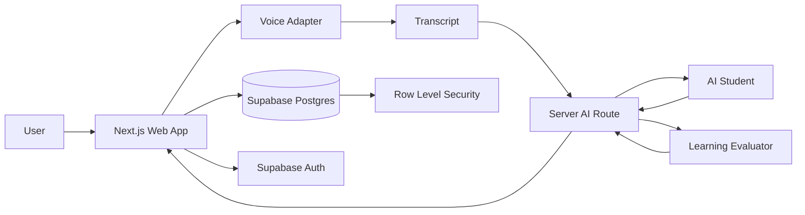

# Feynman-in-a-Loop — Architecture

Status: **Working architecture**  
Last updated: **7 October 2026**

## Goal

Keep the architecture small enough for a hackathon while preserving clean boundaries between:

- browser UI and voice capture;
- authenticated application state;
- AI provider calls;
- structured evaluation;
- persistent learning history.

Provider-specific choices should remain replaceable until a zero-cost AI/voice stack is intentionally selected.

## High-level architecture



## Main components

### Browser / Next.js client
Responsibilities:
- navigation;
- sidebar;
- teaching-room UI;
- Student Orb;
- microphone controls;
- visualizer;
- transcript rendering;
- user-visible state;
- Supabase browser client for allowed user-scoped operations.

Must not contain:
- service-role keys;
- private AI provider keys;
- evaluator system instructions that must remain server-side;
- privileged database logic.

### Next.js server boundary
Use route handlers/server actions where appropriate for:
- private AI calls;
- structured evaluator validation;
- rate limits;
- server-side authorization checks where needed;
- provider abstraction;
- sensitive configuration.

### Supabase Auth
Responsibilities:
- sign up;
- sign in;
- sign out;
- authenticated user identity;
- session/JWT handling.

### Supabase Postgres
Responsibilities:
- session metadata;
- interaction turns/transcripts;
- mastery/evaluation state;
- lightweight profile metadata.

Use RLS on exposed user-owned tables.

### Voice adapter
Exact implementation is open.

The UI should call an internal abstraction rather than directly depending on one provider:

```ts
interface SpeechInputAdapter {
  start(): Promise<void>
  stop(): Promise<void>
  onPartialTranscript(cb: (text: string) => void): void
  onFinalTranscript(cb: (text: string) => void): void
}
```

Possible backends:
- browser SpeechRecognition;
- free hosted STT;
- realtime multimodal API;
- local/browser inference.

### AI provider adapter
Do not let product logic depend on one vendor API shape.

Conceptual interface:

```ts
interface AIProvider {
  studentTurn(input: StudentTurnInput): Promise<StudentTurnOutput>
  evaluate(input: EvaluationInput): Promise<EvaluationOutput>
}
```

A single underlying model may implement both roles using different system instructions.

## Data flow — teaching turn

1. User starts voice input.
2. Speech adapter emits transcript.
3. Transcript is added to current session state.
4. Server receives learner turn plus bounded session context.
5. Evaluator identifies:
   - understood concepts;
   - unresolved gaps;
   - candidate misconception/challenge;
   - whether to move to transfer.
6. Student role generates the learner-facing response constrained by evaluator intent.
7. Server validates structured state.
8. UI updates:
   - student response;
   - Student Orb state;
   - mastery dimensions.
9. Valid turn/state is persisted.

## Data flow — completion

1. Evaluator sees enough evidence.
2. Transfer challenge has been answered.
3. Evaluator returns final structured result.
4. Server validates output.
5. Session becomes `completed`.
6. Final result is persisted.
7. Sidebar/history updates.

## Suggested data model

### profiles
- `id uuid primary key references auth.users`
- `display_name text`
- `avatar_url text nullable`
- `created_at timestamptz`

### learning_sessions
- `id uuid primary key`
- `user_id uuid not null`
- `topic text not null`
- `status text not null`
- `student_state text`
- `mastery_result jsonb`
- `started_at timestamptz`
- `completed_at timestamptz nullable`
- `created_at timestamptz`
- `updated_at timestamptz`

### session_turns
- `id uuid primary key`
- `session_id uuid not null`
- `sequence integer not null`
- `role text not null`
- `interaction_type text not null`
- `content text not null`
- `metadata jsonb`
- `created_at timestamptz`

Possible roles:
- learner
- student
- evaluator/system (do not expose private prompt content)

Possible interaction types:
- explanation
- student_question
- misconception
- correction
- transfer_test
- transfer_answer
- assessment

## RLS model

For every user-owned table:

- authenticated user can select their own rows;
- authenticated user can insert rows owned by their own `auth.uid()`;
- authenticated user can update/delete only their own rows;
- unauthenticated users receive no access unless a table is explicitly public.

Service-role credentials must never be shipped to the browser.

## Context strategy

Do not send unlimited transcripts to the model.

For each turn, construct bounded context:
- topic;
- current mastery state;
- recent relevant turns;
- unresolved misconception;
- current stage.

Persist the full transcript for the user, but keep model context intentional.

## Server-side validation

Evaluator output must be parsed against a schema before persistence.

Example high-level shape:

```json
{
  "stage": "repair",
  "studentState": "confused",
  "dimensions": {
    "coreIdea": "mastered",
    "mechanism": "partial",
    "misconceptionRepair": "untested",
    "transfer": "untested"
  },
  "nextAction": "challenge",
  "targetGap": "sorted invariant"
}
```

If output is invalid:
- retry once with a repair prompt if appropriate;
- otherwise show a recoverable AI error;
- never invent a valid result client-side.

## Deployment

### Vercel
- Next.js application
- server routes
- server-only environment variables

### Supabase
- Auth
- Postgres
- RLS

### AI / voice
Zero-cost provider or local/browser approach selected after testing.

## Architecture principles

1. Keep provider code behind adapters.
2. Keep privileged credentials server-side.
3. Keep learning state structured.
4. Treat model output as untrusted input.
5. Persist only validated state.
6. Avoid unnecessary agents, queues, vector stores, or microservices.
7. Optimize for a reliable 1–3 minute judge demo.

## Open architecture decisions

- Exact AI provider
- Exact STT/voice provider
- Whether student output uses TTS
- Rate-limit implementation
- Exact schema migration details
- Whether session turns are written immediately or batched
